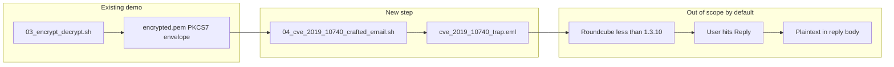

# CVE-2019-10740 demo (Roundcube reply-leak class)

## What the CVE is

Per [NVD CVE-2019-10740](https://nvd.nist.gov/vuln/detail/CVE-2019-10740): in **Roundcube Webmail before 1.3.10**, an attacker who already has a victim’s **S/MIME- or PGP-encrypted** message can **re-wrap** that ciphertext inside a **crafted multipart** message, **conceal** the sensitive part (e.g. with HTML/CSS or newline tricks), and **re-send** it. When the victim **replies** to what looks like a normal thread, Roundcube can **include the decrypted plaintext** of the hidden part in the reply—sending it back to the attacker.

This is primarily a **Roundcube composition / reply-quoting bug**, not a break of PKCS#7 or AES itself. The demo in this repo will show the **MIME packaging** side using your existing pipeline; it will **not** ship or require a full Roundcube install unless you opt into an optional extension later.

## Fit with the current project

The repo already produces a standards-shaped S/MIME envelope in `[demo_out/encrypted.pem](demo_out/encrypted.pem)` (`application/x-pkcs7-mime`, base64). That file is the natural “stolen ciphertext” payload to embed inside a larger message.

## Implementation plan

### 1. New script: build the crafted message

Add `[scripts/04_cve_2019_10740_crafted_email.sh](scripts/04_cve_2019_10740_crafted_email.sh)` that:

- **Inputs**: `demo_out/encrypted.pem` (fail with a clear message if missing—user runs `03_encrypt_decrypt.sh` or `run_all.sh` first).
- **Parses** the existing file to reuse its **S/MIME headers and base64 body** (lines after the blank line following headers), avoiding hand-copying the blob.
- **Writes** `demo_out/cve_2019_10740_trap.eml` as a complete message with minimal RFC 5322 headers (`From`, `To`, `Subject`, `MIME-Version`) and a **multipart** tree, for example:
  - Outer `multipart/alternative` (or `multipart/mixed`) with a **visible** innocuous `text/plain` (and optionally `text/html` with a hidden wrapper, e.g. `display:none` / collapsed block, as described in the CVE text).
  - A **nested** part (or nested multipart) that carries the **same** `application/x-pkcs7-mime` body as `encrypted.pem`, so Bob’s client can still decrypt it if it surfaces the part—mirroring “wrapped as sub-parts.”
- Uses a randomly generated **boundary** string and correct `--boundary--` termination.

Keep it **bash-only** to match `[scripts/01_gen_certs.sh](scripts/01_gen_certs.sh)`–`[scripts/03_encrypt_decrypt.sh](scripts/03_encrypt_decrypt.sh)` (no new language runtime).

### 2. Integrate into the main flow

Update `[scripts/run_all.sh](scripts/run_all.sh)` to invoke the new script **after** encryption produces `encrypted.pem`, so `demo_out/cve_2019_10740_trap.eml` is always regenerated in one command.

### 3. Documentation (short, factual)

Extend `[README.md](README.md)` with a **“CVE-2019-10740 (educational)”** subsection that:

- Links to [NVD CVE-2019-10740](https://nvd.nist.gov/vuln/detail/CVE-2019-10740) and (for implementation detail) [roundcube/roundcubemail#6638](https://github.com/roundcube/roundcubemail/issues/6638).
- States **what** `cve_2019_10740_trap.eml` demonstrates (multipart wrap + concealment pattern).
- States **what it does not prove** by itself: no Roundcube in tree; leakage only with vulnerable Roundcube + **reply** user action.
- Gives one-line instructions: run `./scripts/run_all.sh`, then open/import the `.eml` in a test harness if you maintain one.

(Optional small addition: a one-liner showing `openssl smime -decrypt` on the **inner** blob still yields `[messages/hello.txt](messages/hello.txt)`, proving the embedded part is valid ciphertext—can live in README or as a tiny `scripts/05_...` only if you want it executable; otherwise README is enough.)

## Out of scope (unless you ask later)

- Docker Compose with Roundcube 1.3.9, IMAP, and a browser walkthrough—possible but **much heavier** than the rest of this repo and not required to “show the MIME idea.”

## Success criteria

- `./scripts/run_all.sh` completes and writes `demo_out/cve_2019_10740_trap.eml`.
- The `.eml` is valid multipart MIME and embeds the PKCS#7 from `encrypted.pem`.
- README clearly separates **MIME demo** from **Roundcube-specific exploitation**.

