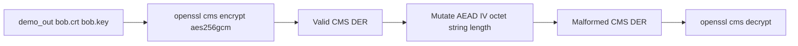

# CVE-2025-15467 OpenSSL CMS demo

## Context (what you are demonstrating)

[CVE-2025-15467](https://nvd.nist.gov/vuln/detail/CVE-2025-15467) is a **stack buffer overflow** in OpenSSL 3.x when parsing **CMS** messages that use **AEAD** ciphers (e.g. **AES-GCM**). While handling ASN.1-encoded AEAD parameters, `evp_cipher_get_asn1_aead_params()` in `crypto/evp/evp_lib.c` copies an IV/nonce into a **fixed 16-byte stack buffer** using a **length taken from the message**, without enforcing `<= EVP_MAX_IV_LENGTH` first. That allows **pre-authentication** memory corruption: the bad length is processed **before** decryption succeeds or keys are validated. High-level writeups: [Orca Security](https://orca.security/resources/blog/cve-2025-15467-openssl-pre-auth-rce/), [NVD](https://nvd.nist.gov/vuln/detail/CVE-2025-15467).

**Why the current repo does not already hit this path:** [scripts/03_encrypt_decrypt.sh](scripts/03_encrypt_decrypt.sh) uses `**openssl smime`** with `**-aes-256-cbc`**. CBC is not AEAD; the vulnerable code path is tied to **AEAD parameter parsing** during CMS-style decrypt, not CBC.

**Scope of this demo (responsible):** Reproduce the **defective parser behavior** (typically **crash / abort / sanitizer trip** on vulnerable builds, **error return** on fixed builds). Do **not** ship or optimize for RCE; distributors often describe hardened builds as **DoS-only** for this overflow.

## Affected vs fixed OpenSSL (for labeling results)

Per advisory summaries (e.g. Orca): vulnerable branches include **3.0.0–3.0.18**, **3.3.0–3.3.5**, **3.4.0–3.4.3**, **3.5.0–3.5.4**, **3.6.0**; fixed in **3.0.19**, **3.3.6**, **3.4.4**, **3.5.5**, **3.6.1**. **1.1.1 / 1.0.2** are **not** affected.

## Technical approach

1. **Prerequisites:** Run existing [scripts/run_all.sh](scripts/run_all.sh) so [demo_out/bob.crt](demo_out/bob.crt) and [demo_out/bob.key](demo_out/bob.key) exist (same trust model as the main demo).
2. **Generate a valid baseline CMS file** using the `**cms`** subcommand (not `smime`), with **AES-256-GCM**, e.g. encrypt [messages/hello.txt](messages/hello.txt) for Bob’s cert to PEM (or DER). Confirm locally with `openssl cms -help` / a trial run that `**-aes-256-gcm`** is accepted on your OpenSSL; if a given build lacks it, document the minimum OpenSSL version or use another AEAD cipher the tool lists.
3. **Malform the message:** Decode PEM to DER, then **programmatically** adjust the **AEAD algorithm parameters** so the embedded **nonce/IV octet string** is **longer than `EVP_MAX_IV_LENGTH`** (and longer than 16), **without re-encoding the rest of the structure incorrectly**. A small **Python 3** helper is the maintainable option (DER layout changes with cert sizes; hard-coded byte offsets from `asn1parse` alone are brittle). Implementation strategy:
  - Use a lightweight ASN.1 library (`**pyasn1` + `pyasn1-modules`**) or `**cryptography`** to walk the CMS structure and replace the relevant **OCTET STRING** payload and its **length** fields, **or** locate the parameter sequence OpenSSL emits for GCM and patch only that TLV.
  - Emit `**demo_out/cve-2025-15467-malformed.pem`** (or similar) plus optional `**good-gcm.pem`** for comparison.
4. **Trigger the parser:** Run `**openssl cms -decrypt`** (with Bob’s key/cert) against the malformed file. **Expected outcomes:**
  - **Vulnerable 3.x:** process may **segfault**, **abort**, or show other memory-corruption signals (environment-dependent).
  - **Patched 3.x:** **clean failure** (parse/crypto error, no crash).
5. **Reproducible environment (recommended):** Add an optional `**Dockerfile`** (or `docker compose` with two targets) that installs a **known vulnerable** OpenSSL package (e.g. pinned distro package version) vs **patched**, and a `**scripts/cve_2025_15467/run_demo.sh`** that prints `openssl version`, runs the helper, runs decrypt, and exits with documented codes. This avoids asking users to downgrade their host OpenSSL.
6. **Documentation:** Add `**scripts/cve_2025_15467/README.md`** (or a short section in the root [README.md](README.md) linking to it) that states:
  - **Educational / authorized testing only**, isolated machine or container.
  - **What** is mutated (oversized IV in AEAD CMS parameters) and **why** that matches the public description of the bug.
  - **Patch / upgrade** as remediation; link [NVD](https://nvd.nist.gov/vuln/detail/CVE-2025-15467) and [Orca](https://orca.security/resources/blog/cve-2025-15467-openssl-pre-auth-rce/).
  - **No public PoC** was assumed; the DER mutation may need **one iteration** after inspecting `openssl asn1parse -inform DER -i` on your generated baseline.

## Files to add (proposed)

| Path                                                                                                    | Role                                                  |
| ------------------------------------------------------------------------------------------------------- | ----------------------------------------------------- |
| [scripts/cve_2025_15467/README.md](scripts/cve_2025_15467/README.md)                                    | Safety, theory, version table, how to run             |
| [scripts/cve_2025_15467/01_make_gcm_cms.sh](scripts/cve_2025_15467/01_make_gcm_cms.sh)                  | Generate valid GCM CMS using `demo_out` certs         |
| [scripts/cve_2025_15467/malform_aead_iv.py](scripts/cve_2025_15467/malform_aead_iv.py)                  | PEM→DER→mutate IV/nonce→PEM                           |
| [scripts/cve_2025_15467/run_demo.sh](scripts/cve_2025_15467/run_demo.sh)                                | Orchestrate: version, build artifacts, decrypt        |
| [scripts/cve_2025_15467/Dockerfile.vulnerable](scripts/cve_2025_15467/Dockerfile.vulnerable) (optional) | Pin vulnerable OpenSSL for reliable “before” behavior |
| [scripts/cve_2025_15467/requirements.txt](scripts/cve_2025_15467/requirements.txt)                      | If using PyPI deps for ASN.1                          |

Root [README.md](README.md): one short subsection linking to the CVE demo folder so the main S/MIME flow stays primary.

## Risks and constraints

- **Implementation uncertainty:** Public articles do not include a byte-level PoC; the first implementation pass should validate structure with `openssl asn1parse` and adjust the mutation target if OpenSSL’s GCM parameter encoding differs (e.g. nested SEQUENCE vs raw OCTET STRING).
- **Host safety:** Prefer **Docker** for the “crash” case so a segfault does not take down the user’s shell session on a shared machine.
- **Legal/ethical:** Frame as **defensive verification** and **patch motivation**, not weaponization.

## Success criteria

- With **vulnerable** OpenSSL in a container, `run_demo.sh` shows **abnormal termination** (or equivalent) when decrypting the malformed GCM CMS.
- With **patched** OpenSSL, the same input yields **non-crashing failure**.
- Artifacts and steps are **repeatable** from a clean clone after `./scripts/run_all.sh`.

