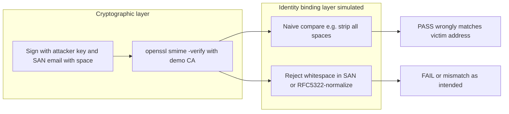

# CVE-2026-2748 educational PoC (whitespace in S/MIME cert email)

## Context and limits

- [CVE-2026-2026-2748](https://www.sentinelone.com/vulnerability-database/cve-2026-2748/) describes **improper certificate validation** in **SEPPmail Secure Email Gateway** (fixed in **15.0.1**): S/MIME certs whose email SAN contains **whitespace** are not normalized/rejected correctly, so **cryptographic verification** can succeed while **identity binding** to the message sender is wrong—**signature spoofing** from the recipient’s perspective ([SentinelOne summary](https://www.sentinelone.com/vulnerability-database/cve-2026-2748/)).
- This workspace has no SEPPmail product code. The PoC will **model the same class of bug** (CWE-295): **valid CMS signature** + **unsafe comparison** between **From** (or displayed address) and **signer cert email**.
- **Ethics**: README will state clearly that this is for **authorized lab use**, defensive validation testing, and education—not for attacking systems without permission.

## What the demo will prove

- **OpenSSL `smime -verify`** only proves **integrity + chain to trust anchor**; it does **not** enforce “cert email equals From.” That is exactly why a **second-layer bug** (like the CVE) matters.
- On this environment, **OpenSSL 3** accepts `-addext "subjectAltName=email:ceo@ company.com"`; the SAN is emitted as `email:ceo@ company.com` in `x509 -text`. That matches the article’s “whitespace in certificate subject email” narrative.

## Repository changes (isolated from existing demo)

Keep [scripts/run_all.sh](scripts/run_all.sh) and [scripts/01_gen_certs.sh](scripts/01_gen_certs.sh) unchanged so the original Alice/Bob demo stays intact.

| Addition                                                  | Role                                                                                                                                                                                                                                                                                                                                                                                                                                                                                                                                                                             |
| --------------------------------------------------------- | -------------------------------------------------------------------------------------------------------------------------------------------------------------------------------------------------------------------------------------------------------------------------------------------------------------------------------------------------------------------------------------------------------------------------------------------------------------------------------------------------------------------------------------------------------------------------------- |
| `poc_cve_2026_2748/demo_out/` (gitignored or regenerated) | CA + attacker key/cert + signed artifact                                                                                                                                                                                                                                                                                                                                                                                                                                                                                                                                         |
| `poc_cve_2026_2748/scripts/01_gen_ca_and_attacker.sh`     | Create demo CA; create attacker key/CSR with `-addext "subjectAltName=email:ceo@ company.com"` (and CN like `Attacker`); sign with CA                                                                                                                                                                                                                                                                                                                                                                                                                                            |
| `poc_cve_2026_2748/scripts/02_build_and_sign_message.sh`  | Build a minimal MIME **with `From: ceo@company.com`** (victim-shaped address) and body text; `openssl smime -sign` with attacker cert/key, output `signed_spoof.pem`                                                                                                                                                                                                                                                                                                                                                                                                             |
| `poc_cve_2026_2748/scripts/03_gateway_binding_check.py`   | **Stdlib only** (Python 3): (1) run `openssl smime -verify` on `signed_spoof.pem` and report exit status; (2) extract signer PEM via `openssl pkcs7 -print_certs` or `openssl cms -verify -signerfile` pattern as appropriate; (3) parse **first rfc822Name** from `openssl x509 -noout -ext subjectAltName` text or `-text`; (4) compare to `From` with **two modes**: `vulnerable` (e.g. remove **all** ASCII whitespace from both sides—shows false “match” with `ceo@company.com`); `strict` (reject if SAN email contains whitespace, matching the vendor fix description). |
| `poc_cve_2026_2748/scripts/run_poc.sh`                    | `set -euo pipefail`, runs 01 → 02 → 03 and prints a short narrative                                                                                                                                                                                                                                                                                                                                                                                                                                                                                                              |
| `poc_cve_2026_2748/README.md`                             | CVE summary, link to SentinelOne + SEPPmail disclosure, **not SEPPmail** disclaimer, run instructions, mitigation (upgrade 15.0.1+), defensive recommendation (normalize/reject malformed rfc822Name)                                                                                                                                                                                                                                                                                                                                                                            |

Optional: root [README.md](README.md) add a **short pointer** (one subsection + link) to `poc_cve_2026_2748/README.md` so discoverability is clear without duplicating the full CVE write-up.

## Implementation notes

- **Cert issuance**: Reuse the same pattern as [scripts/01_gen_certs.sh](scripts/01_gen_certs.sh) (CSR + `x509 -req` with CA), but add `-copy_extensions copy` or embed SAN via CSR `-addext` so the attacker cert carries the whitespace email SAN.
- **S/MIME file**: Use `-text` on sign so MIME headers are sensible; the important part is the `**From:`** line the script controls vs. the **SAN** on the signer cert.
- **Python parsing**: Prefer subprocess to OpenSSL for portability with the rest of the repo; avoid new pip dependencies.
- **Success criteria**: After `./poc_cve_2026_2748/scripts/run_poc.sh`, output shows: **verify OK**; **vulnerable** binding says **MATCH** (or equivalent); **strict** binding says **REJECT** / **NO MATCH**. That mirrors the article’s “passes verification but wrong identity binding” story.

## Out of scope

- No exploit against a real SEPPmail appliance or network service.
- No attempt to obtain a public-CA certificate with a space in the local-part (public CAs should reject; the PoC uses the **local demo CA** only).

