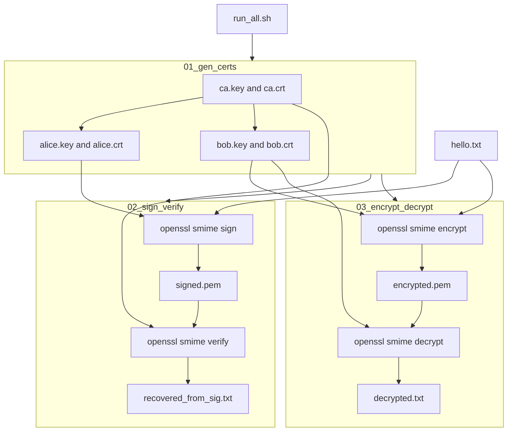
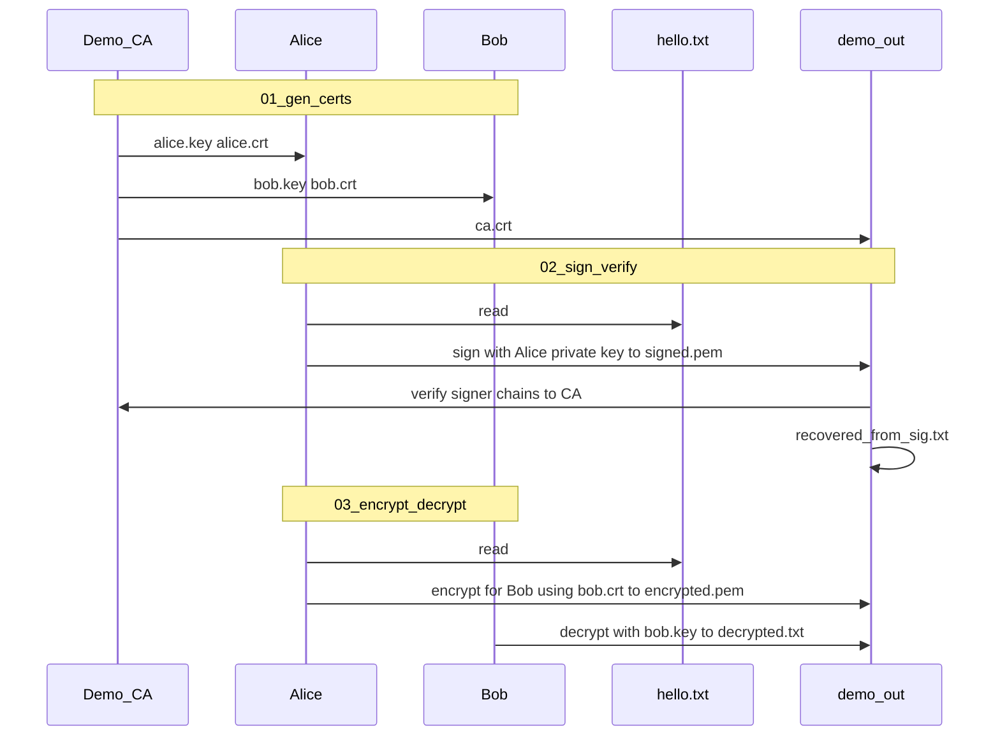

# S/MIME demo (Shell + OpenSSL)

## Goal

Deliver an **educational, reproducible** demo of S/MIME in an empty workspace: **digital signatures** (integrity + sender authentication) and **encryption** (confidentiality), using **PEM certificates** and OpenSSL’s `smime` subcommand. No application code beyond shell scripts.

## What S/MIME does here (for the README)

- **Sign**: Alice’s private key produces a **CMS/PKCS#7** detached or enveloped signature over the message; verifiers use Alice’s certificate (and trust in the issuing CA).
- **Encrypt**: The message is encrypted for **Bob’s public key** (from Bob’s cert); only Bob’s private key can decrypt.
- **Artifacts**: `.pem` / `.crt` / `.key` files under a generated directory (e.g. `demo_out/`), plus `messages/*.txt` and `artifacts/*.pem` for signed/encrypted output.

**Mermaid diagrams for README** — copy both fenced blocks into [README.md](README.md) so GitHub/GitLab and Mermaid-capable editors render them.

### 1 — Full demo flow (flowchart)

Shows: `run_all.sh` → `01_gen_certs` (demo CA issues Alice and Bob) → two parallel tracks from `hello.txt` — **sign/verify** (Alice + `ca.crt` trust) and **encrypt/decrypt** (Bob’s material), including file names under `demo_out/`.

### 2 — Alice, Bob, and CA (sequence diagram)

Security-centric view of the same demo: **Demo CA** bootstraps **Alice** and **Bob**; Alice **signs** and (for encryption) uses **Bob’s certificate** as the recipient; Bob **decrypts**. Artifacts still land under `demo_out/` as in the shell scripts (`run_all.sh` runs the three steps in order).

## Repository layout (to add)

| Path                                                           | Purpose                                                                                                                                                                |
| -------------------------------------------------------------- | ---------------------------------------------------------------------------------------------------------------------------------------------------------------------- |
| [scripts/01_gen_certs.sh](scripts/01_gen_certs.sh)             | Create `demo_out/ca.{key,crt}`, `demo_out/alice.{key,crt}`, `demo_out/bob.{key,crt}` via CSR + CA sign (RSA 2048, 365-day demo validity).                              |
| [scripts/02_sign_verify.sh](scripts/02_sign_verify.sh)         | Sign [messages/hello.txt](messages/hello.txt) with Alice; write `demo_out/signed.pem`; verify using CA trust (`-CAfile`) and output `demo_out/recovered_from_sig.txt`. |
| [scripts/03_encrypt_decrypt.sh](scripts/03_encrypt_decrypt.sh) | Encrypt `hello.txt` for Bob (`-encrypt` with `bob.crt`); decrypt with Bob’s key/cert; write `demo_out/encrypted.pem` and `demo_out/decrypted.txt`.                     |
| [scripts/run_all.sh](scripts/run_all.sh)                       | `set -euo pipefail`, create `demo_out/`, run 01 → 02 → 03 in order.                                                                                                    |
| [messages/hello.txt](messages/hello.txt)                       | Short sample body (a few lines).                                                                                                                                       |
| [README.md](README.md)                                         | Same as above, plus **two Mermaid blocks** from “Mermaid diagrams for README”: full-flow **flowchart** and **Alice, Bob, and CA sequence diagram** (section 2).        |

## OpenSSL behavior to rely on

- **Sign**: `openssl smime -sign -in ... -text -signer alice.crt -inkey alice.key -out signed.pem` (include signer cert in the message for straightforward verification).
- **Verify**: `openssl smime -verify -in signed.pem -CAfile ca.crt -out recovered.txt` (fail closed if verification fails).
- **Encrypt**: `openssl smime -encrypt -aes-256-cbc -in hello.txt bob.crt -out encrypted.pem` (algorithm flag explicit for reproducibility).
- **Decrypt**: `openssl smime -decrypt -in encrypted.pem -recip bob.crt -inkey bob.key -out decrypted.txt`.

## Script quality

- All scripts: `#!/usr/bin/env bash`, `set -euo pipefail`, paths relative to repo root (derive `ROOT` from script location).
- Idempotent enough: `mkdir -p demo_out`; overwriting same output filenames is OK for a demo.
- No `git` required (folder is not a repo today).

## Success criteria

- After `./scripts/run_all.sh`, `recovered_from_sig.txt` and `decrypted.txt` match `messages/hello.txt`.
- README lets someone unfamiliar run the demo in order and understand which step maps to **sign**, **verify**, **encrypt**, **decrypt**, and includes both Mermaid figures: the **full-flow flowchart** and the **Alice, Bob, and CA sequence diagram**.

