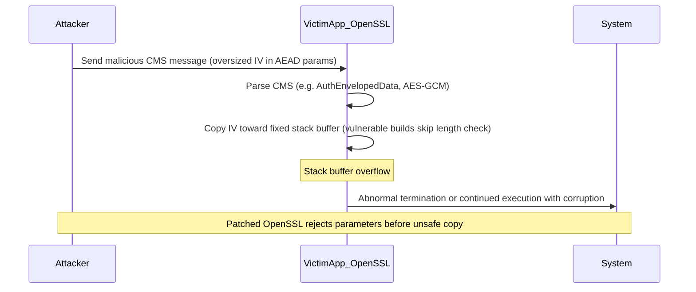

# CVE-2025-15467 — OpenSSL CMS AEAD parameter demo

Educational material only. Use on **your own** systems or **disposable** environments. Do not point untrusted inputs at production mail gateways or parsers.

## Simple explanation

### Scope

This issue affects **OpenSSL 3.x** (branches such as 3.0 through 3.6 in advisory ranges) when it handles encrypted message formats that use **CMS** (Cryptographic Message Syntax), including **PKCS#7** and **S/MIME**-style content, and the code path parses **AEAD** parameters (for example **AES-GCM**).

### Normal behavior

When OpenSSL parses an encrypted CMS message that uses a modern AEAD cipher:

1. It reads **algorithm parameters** from the message, including the **IV / nonce** used with that cipher.
2. It uses those parameters to set up the cipher context.
3. **Authentication** (for GCM, the tag check) and **decryption** follow once parameters and keys are consistent with the message.

### The bug

For AEAD, the implementation copied the **IV / nonce** bytes into a **fixed-size stack buffer**. **Before** that copy, vulnerable versions did **not** reliably enforce that the declared length was within **`EVP_MAX_IV_LENGTH`**. If the message claimed a **very large** IV, the copy could **overflow** that buffer—a **stack buffer overflow**.

### Why this is dangerous

- The problematic copy happens while **parsing** the structure, **before** authentication completes and **without** needing the victim to possess or validate attacker keys for the overflow step (“**pre-auth**” in public descriptions).
- Impact can range from **process crash** (**denial of service**) to, on some platforms and builds, **memory corruption** that might in principle be abused for **code execution** (mitigations vary; many vendors describe **DoS** as the reliable outcome on hardened builds).

### Key idea

**Attacker-controlled length** (how many bytes to copy) was applied to a **fixed-size** stack buffer **without a proper bounds check** before the copy.

### Realistic attack scenario

1. An attacker crafts a malicious CMS / S/MIME-style message (for example **AES-GCM** with **oversized IV / nonce** in AEAD parameters).
2. The message is delivered to a **victim system** (mail server, client, or any application that **parses** untrusted CMS with OpenSSL).
3. The application calls into OpenSSL; the library **parses** the CMS blob and hits the **AEAD parameter** handling.
4. On a **vulnerable** build, copying the IV can **corrupt the stack** → **crash** or worse depending on environment.
5. On a **patched** build, the length is **rejected** and parsing fails **without** that overflow.

### High-level sequence (attacker → victim → system)



## What this shows

[CVE-2025-15467](https://nvd.nist.gov/vuln/detail/CVE-2025-15467) is a stack buffer overflow in OpenSSL 3.x when **CMS** parses **AEAD** (e.g. AES-GCM) **algorithm parameters**: an attacker-controlled **IV/nonce length** was copied into a **fixed 16-byte stack buffer** without checking against `EVP_MAX_IV_LENGTH` first. That happens **before** successful decryption or key validation (“pre-auth”). See [Orca Security](https://orca.security/resources/blog/cve-2025-15467-openssl-pre-auth-rce/) for a readable overview.

This demo:

1. Builds a **valid** `AuthEnvelopedData` CMS blob with **`openssl cms -encrypt -aes-256-gcm`** (uses `demo_out/bob.crt` from the main demo).
2. Rewrites the **GCMParameters** nonce (`OCTET STRING`) to **64 bytes** (greater than a normal maximum IV length), and fixes outer **DER** lengths.
3. Runs **`openssl cms -decrypt`** on the malformed file.

**Expected results (vary by build):**

- **Patched OpenSSL** (e.g. fixed 3.0.19+ / 3.3.6+ / 3.4.4+ / 3.5.5+ / 3.6.1+): decrypt fails with a **cipher / CMS parameter error** (no crash). You may see `evp_cipher_asn1_to_param_ex` or `CMS` routines in the error text.
- **Vulnerable OpenSSL 3.x**: the process may **crash** (e.g. segmentation fault) or abort when parsing the bad parameters. Hardened distributions sometimes limit impact to **denial of service**; do not assume RCE.

**Not affected:** OpenSSL 1.1.1 / 1.0.2 (see vendor advisory).

## How it works (OpenSSL internals, sequence diagram)

The bug is on the **parse** path for **AEAD algorithm parameters** inside CMS **before** decryption succeeds or keys are proven valid (“pre-auth”). The message advertises a **nonce/IV length**; vulnerable code **trusted** that length when copying into a **small stack buffer** (see `evp_cipher_get_asn1_aead_params` in public analyses).

```mermaid
sequenceDiagram
  participant attacker as UntrustedCMS
  participant app as Application
  participant cms as CMS_decrypt
  participant enc as CMS_EncryptedContent
  participant evp as evp_cipher_get_asn1_aead_params
  participant stack as StackBuffer_16B

  attacker->>app: Deliver AuthEnvelopedData (e.g. AES-GCM) with malicious GCMParameters
  app->>cms: CMS_decrypt(...)
  cms->>enc: Parse contentEncryptionAlgorithm + AEAD params (ASN.1)
  enc->>evp: Decode nonce/IV from parameters OCTET STRING
  Note over evp,stack: Claimed length L comes from the message (attacker-controlled)

  alt Vulnerable OpenSSL 3.0.x–3.0.18 (and other affected branches)
    evp->>stack: Copy L bytes into fixed 16-byte buffer without checking L less than or equal to EVP_MAX_IV_LENGTH
    stack-->>app: Stack corruption / crash (DoS; RCE depends on mitigations)
  else Patched OpenSSL
    evp-->>enc: Reject oversized IV (cipher parameter error)
    enc-->>cms: Fail before decrypt
    cms-->>app: Error return (no crash)
  end
```

**Fix (conceptually):** enforce **IV length ≤ `EVP_MAX_IV_LENGTH`** before copying, as described in public writeups (e.g. [Orca](https://orca.security/resources/blog/cve-2025-15467-openssl-pre-auth-rce/)).

## Affected vs fixed versions (summary)

| Branch   | Vulnerable (examples) | Fixed (upgrade to) |
|----------|------------------------|--------------------|
| 3.6.x    | 3.6.0                  | 3.6.1+             |
| 3.5.x    | 3.5.0–3.5.4            | 3.5.5+             |
| 3.4.x    | 3.4.0–3.4.3            | 3.4.4+             |
| 3.3.x    | 3.3.0–3.3.5            | 3.3.6+             |
| 3.0.x    | 3.0.0–3.0.18           | 3.0.19+            |

## Prerequisites

- `bash`, `python3` (stdlib only — no pip packages)
- `openssl` with **`cms`** and **`-aes-256-gcm`** support (OpenSSL 3.x is typical)
- Certificates from the main demo: run **`./scripts/run_all.sh`** once so `demo_out/bob.{crt,key}` exist

## Run (quick demo on your host)

From the repository root:

```bash
./scripts/run_all.sh
./CVE-2025-15467/run_demo.sh
```

Many Linux distributions **backport** the CVE fix into their `openssl` package, so you may only see a **cipher parameter error** (exit code 4), not a crash. That still shows **unsafe input is rejected**; it does not prove absence of the bug on unpatched upstream builds.

## Full PoC (vulnerable upstream OpenSSL 3.0.18 in Docker)

The **full proof of concept** compiles **unpatched upstream [OpenSSL 3.0.18](https://www.openssl.org/source/)** (listed as vulnerable through 3.0.18 in [CVE-2025-15467](https://nvd.nist.gov/vuln/detail/CVE-2025-15467)), then runs the same malformed **AuthEnvelopedData** blob through `openssl cms -decrypt`. On that build, the process often exits with a **non-zero signal-style code** (for example **139** = 128 + 11 for **SIGSEGV**), consistent with **stack corruption** during AEAD parameter handling.

**Requirements:** Docker, network access for the OpenSSL source tarball (first build compiles OpenSSL; expect several minutes).

From the repository root:

```bash
chmod +x CVE-2025-15467/run_full_poc.sh CVE-2025-15467/docker_poc_entry.sh
./CVE-2025-15467/run_full_poc.sh
```

Or manually:

```bash
docker build -f CVE-2025-15467/Dockerfile.poc -t cve-2025-15467-poc .
docker run --rm cve-2025-15467-poc
```

What this runs: [docker_poc_entry.sh](docker_poc_entry.sh) → `./scripts/run_all.sh` → GCM encrypt → [malform_aead_iv.py](malform_aead_iv.py) → **`openssl cms -decrypt`** using the **vulnerable** `openssl` on `PATH` inside the image.

This PoC demonstrates **memory corruption / DoS** on a known-vulnerable upstream version. It is **not** a weaponized **RCE** exploit.

### Full PoC without Docker (advanced)

Build OpenSSL **3.0.18** yourself with `--prefix=/opt/openssl-vuln`, then:

```bash
export OPENSSL=/opt/openssl-vuln/bin/openssl
./scripts/run_all.sh
./CVE-2025-15467/run_demo.sh
```

`run_demo.sh` and `01_make_gcm_cms.sh` honor the **`OPENSSL`** environment variable for the `openssl` binary.

### Artifacts

- `demo_out/good-gcm.pem` — valid AES-256-GCM CMS
- `demo_out/cve-2025-15467-malformed.pem` — same structure with oversized GCM nonce
- `demo_out/cve-2025-15467-decrypt-attempt.txt` — only created if decrypt **succeeds** (unexpected for this PoC)

## Optional: lightweight Docker (distro OpenSSL only)

[Dockerfile.vulnerable](Dockerfile.vulnerable) installs the distro `openssl` package only (no compile). Use it to **isolate** runs; it may already be **patched** by the vendor.

```bash
docker build -f CVE-2025-15467/Dockerfile.vulnerable -t cve-2025-15467-demo .
docker run --rm -v "$PWD:/work" -w /work cve-2025-15467-demo ./CVE-2025-15467/run_demo.sh
```

## Remediation

Upgrade OpenSSL to a **fixed** release in your branch, or use distribution packages that include the vendor’s CVE fix. Follow [NVD](https://nvd.nist.gov/vuln/detail/CVE-2025-15467) and your OS vendor’s security notices.
