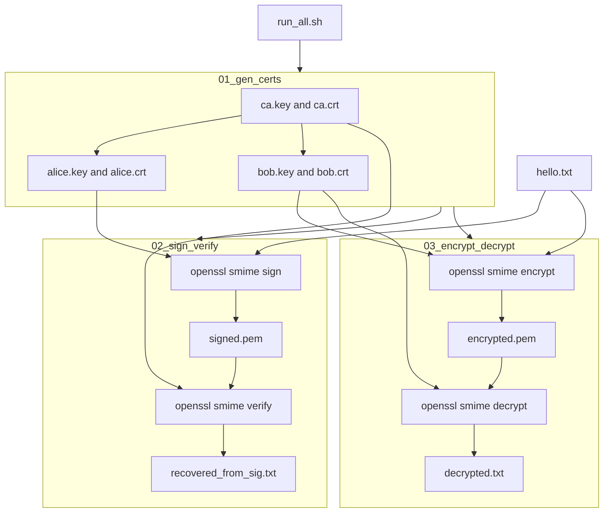
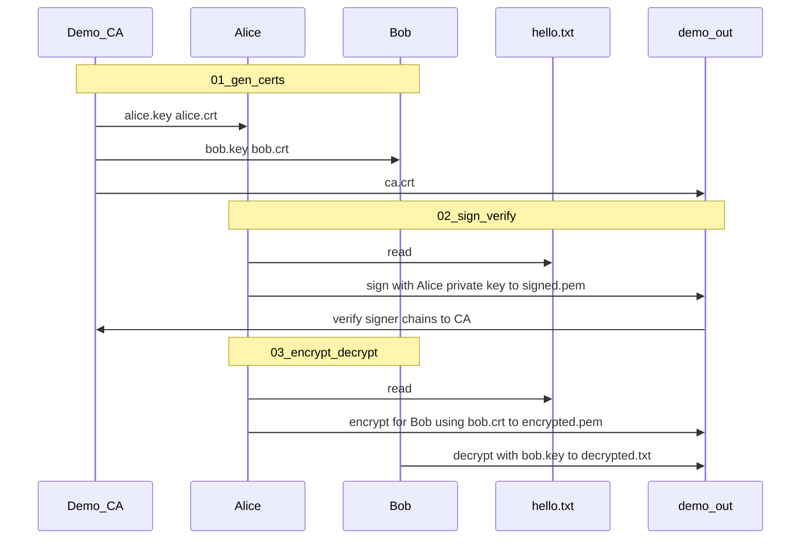

# S/MIME demo (Shell + OpenSSL)

Small, reproducible demo of **S/MIME-style** operations using PEM certificates and OpenSSL’s `smime` command:

- **Sign** — Alice’s private key produces a CMS/PKCS#7 signature over the message; verifiers use Alice’s certificate and trust in the issuing CA.
- **Encrypt** — The message is encrypted for **Bob’s public key** (from Bob’s certificate); only Bob’s private key can decrypt.

This is for **learning only**. Keys and the demo CA are generated locally and are **not** safe for production.

## Prerequisites

- `bash`
- `openssl` on your `PATH`

## Run the demo

From the repository root:

```bash
./scripts/run_all.sh
```

That creates `demo_out/`, generates a demo CA plus Alice and Bob certificates, signs and verifies [messages/hello.txt](messages/hello.txt), then encrypts and decrypts the same file. After a successful run:

- [demo_out/recovered_from_sig.txt](demo_out/recovered_from_sig.txt) matches the plaintext in `messages/hello.txt`.
- [demo_out/decrypted.txt](demo_out/decrypted.txt) matches the same plaintext.

## CVE-2019-10740 (educational PoC)

A separate lab under [poc_cve_2019_10740/README.md](poc_cve_2019_10740/README.md) builds a **multipart `.eml`** that embeds PKCS#7 from [demo_out/encrypted.pem](demo_out/encrypted.pem), modeled on [CVE-2019-10740](https://nvd.nist.gov/vuln/detail/CVE-2019-10740) ([roundcube#6638](https://github.com/roundcube/roundcubemail/issues/6638)). Run the main demo first (so `encrypted.pem` exists), then:

```bash
./poc_cve_2019_10740/scripts/run_poc.sh
```

**Optional — full UI lab** (Docker: Roundcube 1.3.9 + GreenMail, then browser): [poc_cve_2019_10740/docker/README.md](poc_cve_2019_10740/docker/README.md)

```bash
./poc_cve_2019_10740/scripts/run_full_stack_demo.sh
```

Output: `poc_cve_2019_10740/demo_out/cve_2019_10740_trap.eml`. To confirm the ciphertext matches the main demo, decrypt with `openssl smime -decrypt` using [demo_out/bob.crt](demo_out/bob.crt) and [demo_out/bob.key](demo_out/bob.key) on `../demo_out/encrypted.pem` or the extracted inner part.

## CVE-2025-15467 (OpenSSL CMS AEAD)

After `./scripts/run_all.sh`, an isolated demo builds a malformed **AES-GCM** CMS message (oversized GCM nonce) and runs `openssl cms -decrypt` to illustrate [CVE-2025-15467](https://nvd.nist.gov/vuln/detail/CVE-2025-15467) ([Orca summary](https://orca.security/resources/blog/cve-2025-15467-openssl-pre-auth-rce/)). See [CVE-2025-15467/README.md](CVE-2025-15467/README.md).

```bash
./scripts/run_all.sh
./CVE-2025-15467/run_demo.sh
```

**Full PoC** (builds upstream OpenSSL **3.0.18** in Docker, then runs decrypt — often **SIGSEGV** on vulnerable builds): `./CVE-2025-15467/run_full_poc.sh`

## CVE-2026-2748 educational PoC

A separate lab under [poc_cve_2026_2748/README.md](poc_cve_2026_2748/README.md) demonstrates **valid S/MIME verification** alongside **unsafe vs strict identity binding** when the signer certificate’s email SAN contains whitespace (modeled after [CVE-2026-2748](https://www.sentinelone.com/vulnerability-database/cve-2026-2748/)). From the repository root:

```bash
./poc_cve_2026_2748/scripts/run_poc.sh
```

### Scripts (individual steps)

| Script | What it does |
|--------|----------------|
| [scripts/01_gen_certs.sh](scripts/01_gen_certs.sh) | Writes `demo_out/ca.{key,crt}`, `alice.{key,crt}`, `bob.{key,crt}`. |
| [scripts/02_sign_verify.sh](scripts/02_sign_verify.sh) | `smime -sign` with Alice → `signed.pem`; `smime -verify` with `-CAfile ca.crt` → `recovered_from_sig.txt`. |
| [scripts/03_encrypt_decrypt.sh](scripts/03_encrypt_decrypt.sh) | `smime -encrypt` with AES-256-CBC for Bob → `encrypted.pem`; `smime -decrypt` → `decrypted.txt`. |

OpenSSL often writes **CRLF** line endings and, with `-text` signing, a short **MIME header** before the body. The verify script strips carriage returns and drops the header block so the recovered file **byte-matches** Unix `LF` plaintext in `messages/hello.txt`. The decrypt script normalizes line endings the same way.

## Diagrams

### Full demo flow (flowchart)



### Alice, Bob, and CA (sequence diagram)


