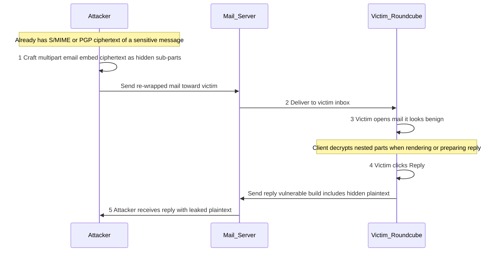
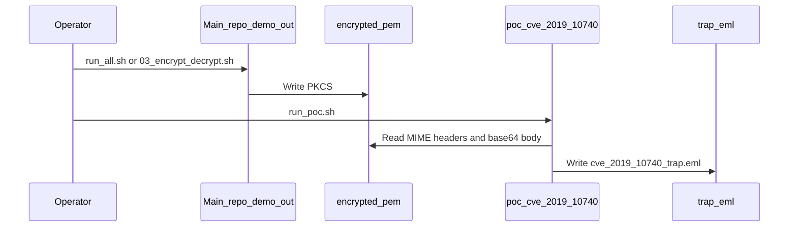
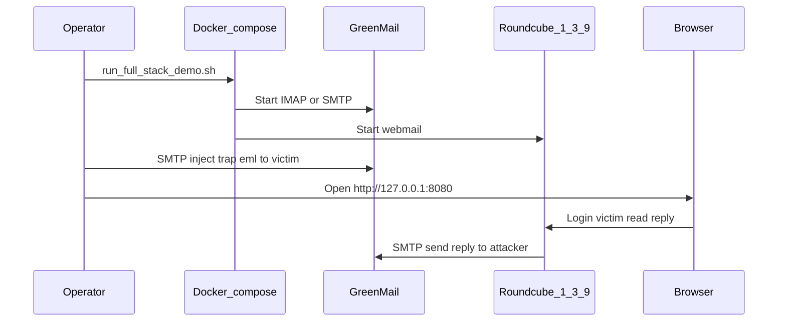

# CVE-2019-10740 educational PoC (multipart wrap)

Lab-only demo of the **MIME packaging** pattern described in [CVE-2019-10740](https://nvd.nist.gov/vuln/detail/CVE-2019-10740): an attacker can **wrap** stolen **S/MIME** (or PGP) ciphertext as **nested multipart** sub-parts, **hide** them (HTML/CSS, newlines), and **re-send**. In **Roundcube Webmail before 1.3.10**, a victim who **replies** could unknowingly **quote decrypted plaintext** back to the attacker ([roundcube#6638](https://github.com/roundcube/roundcubemail/issues/6638)).

By default the scripts only build `demo_out/cve_2019_10740_trap.eml` using PKCS#7 from the **main** demo’s `../demo_out/encrypted.pem`. An **optional Docker stack** ([docker/](docker/)) runs **Roundcube 1.3.9** and **GreenMail** so you can walk the flow in a browser (lab network only).

## How it works

### CVE-2019-10740 in plain terms

This finding is **not** about cracking S/MIME or OpenPGP crypto. The attacker is assumed to **already have** a copy of an encrypted message (for example from earlier interception or leaks). They then:

1. **Re-package** that ciphertext as a **nested MIME sub-part** inside a new, **multipart** message so it is no longer the obvious “main” body.
2. **Hide** those sub-parts so the thread still looks normal—using **HTML/CSS** (e.g. invisible or collapsed blocks) or **extra ASCII newlines** so the victim does not notice the sensitive block.
3. **Send** that crafted message to the real recipient (same person the mail was originally for), often so it reads like a harmless follow-up.

The recipient opens it in **[Roundcube Webmail before 1.3.10](https://github.com/roundcube/roundcubemail/releases/tag/1.3.10)**. The client **decrypts** nested encrypted parts when it needs to show or handle them. When the victim hits **Reply**, a bug in **how Roundcube builds the reply** can **quote or include the decrypted plaintext** of those hidden parts in the reply body. If the reply goes back to the attacker (typical when the attacker controls the visible thread or addressing), the **secret content leaks** as ordinary mail—without the victim realizing they pasted it.

**Mitigation:** upgrade Roundcube to **1.3.10 or later** (see [NVD CVE-2019-10740](https://nvd.nist.gov/vuln/detail/CVE-2019-10740) and [roundcube#6638](https://github.com/roundcube/roundcubemail/issues/6638)).

### Attack flow (sequence diagram)

Three roles: **Attacker**, **Mail server** (delivery and relay), and **Victim** using **Roundcube** in the browser.



### This repository — MIME file (no UI)

Shows how **one PKCS#7 blob** from the main demo is **embedded** inside a **multipart** message (visible text, padding/HTML, nested `application/x-pkcs7-mime`).



### Full stack demo (Docker: Roundcube 1.3.9 + GreenMail)

End-to-end lab: builds the `.eml`, starts mail + webmail, **injects** the message into the victim mailbox over SMTP, then you **log in**, **open**, and **Reply** in Roundcube. Optional: poll `attacker@localhost`’s IMAP for a known plaintext marker (may appear if the reply quotes decrypted content).



Details and credentials: [docker/README.md](docker/README.md). **Caveats:** seeing **decrypted S/MIME** in the UI usually requires the recipient’s private key in Roundcube; the historical bug is still the **reply composer** quoting hidden parts. Do not expose these containers publicly.

## Prerequisites

- `bash`, `openssl`
- Main repo already ran **encrypt** so `../demo_out/encrypted.pem` exists (e.g. run `./scripts/run_all.sh` or `./scripts/03_encrypt_decrypt.sh` from the repository root).

## Run

**Multipart file only** — from the repository root:

```bash
./poc_cve_2019_10740/scripts/run_poc.sh
```

**Full stack (Docker + browser)** — requires Docker; from the repository root:

```bash
./poc_cve_2019_10740/scripts/run_full_stack_demo.sh
```

Or from this directory: `./scripts/run_poc.sh` / `./scripts/run_full_stack_demo.sh`.

## Scripts

| Script | Purpose |
|--------|---------|
| `scripts/01_crafted_trap_email.sh` | Reads `../demo_out/encrypted.pem` → writes `demo_out/cve_2019_10740_trap.eml` |
| `scripts/run_poc.sh` | Runs the step above |
| `scripts/send_trap_to_greenmail.py` | SMTP inject of the trap (rewrites From/To to `attacker@localhost` / `victim@localhost`) |
| `scripts/check_attacker_inbox.py` | IMAP poll on `attacker@localhost` for a plaintext marker (optional) |
| `scripts/run_full_stack_demo.sh` | Compose up, wait for HTTP, ensure `encrypted.pem`, run PoC, send trap, print manual steps |

To confirm the embedded blob decrypts for Bob (same as `encrypted.pem`):

```bash
openssl smime -decrypt -in ../demo_out/encrypted.pem -recip ../demo_out/bob.crt -inkey ../demo_out/bob.key
```
