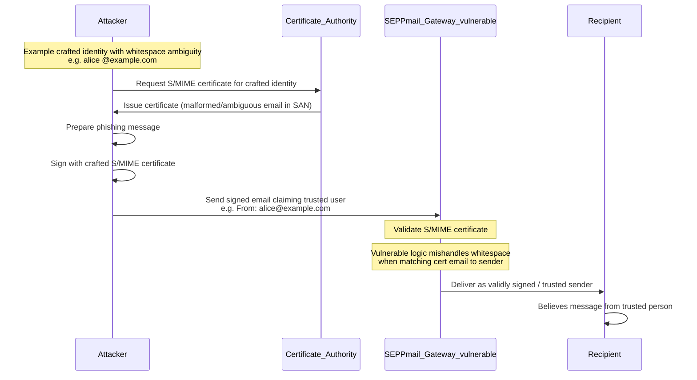

# CVE-2026-2748 — educational PoC (S/MIME identity binding vs whitespace)

This folder is a **local lab only**. It does **not** ship SEPPmail. Scripts model how **cryptographic** S/MIME verification can succeed while **application-layer** identity binding fails if email addresses are compared without proper normalization—matching the class of issue described for [CVE-2026-2748](https://www.sentinelone.com/vulnerability-database/cve-2026-2748/) (SEPPmail Secure Email Gateway **before 15.0.1**).

**Ethics:** Use only on systems you own or are authorized to test. Do not use to mislead people or attack production mail infrastructure.

---

## Plain-English explanation

### What it is

CVE-2026-2748 affects **SEPPmail Secure Email Gateway** before **15.0.1**.

The issue is in how it validates **S/MIME certificates** for email addresses that contain **whitespace**. Because of that, an attacker can abuse **certificate matching** and make a digitally signed email **appear** to come from someone else.

### Why this matters

S/MIME signatures are supposed to prove:

1. **Who sent** the email  
2. That the **content was not altered**

If the gateway incorrectly accepts a certificate tied to an email address with **whitespace tricks**, it may treat a malicious sender as a **trusted identity**.

That means a recipient could see a message as **validly signed**, even though the signer is **not** actually the claimed sender.

### Root cause

The vulnerability comes from **improper validation / normalization** of email addresses in S/MIME certificate handling.

**Typical secure behavior** would be:

- Extract the email address from the certificate (e.g. **rfc822Name** in Subject Alternative Name).  
- **Canonicalize** it safely (or reject malformed values).  
- Compare it **exactly** against the sender identity.  
- **Reject** malformed or ambiguous addresses.

**Vulnerable behavior** may:

- Trim or normalize whitespace **inconsistently**.  
- Compare addresses **loosely**.  
- Accept a certificate whose subject email is **ambiguous** because of spaces.

**Example:**

| Role | Address |
|------|---------|
| Real user (claimed sender) | `alice@example.com` |
| Crafted certificate identity | `alice @example.com` (space after `alice`) |

If validation **collapses or ignores** whitespace in the wrong place, the system may wrongly accept the crafted certificate as belonging to Alice.

### Attack outcome

An attacker can:

1. Obtain or use an S/MIME certificate with a **whitespace-manipulated** email identity.  
2. Sign a malicious message.  
3. Send it through the gateway.  
4. Cause the gateway or downstream recipient to believe the signature belongs to a **different, trusted** user.

This is a **signature spoofing** problem at the **identity-binding** layer, not necessarily account takeover.

---

## Sequence diagram (conceptual)



---

## What this demo does

1. A **demo CA** issues an attacker certificate whose SAN email is literally **`alice @example.com`** (space before `@`).  
2. The signed message uses **`From: alice@example.com`** (no space).  
3. **`openssl smime -verify`** succeeds: signature and chain are **cryptographically** valid.  
4. A **naïve binding** that strips **all** ASCII whitespace then compares wrongly reports **MATCH** (spoof accepted).  
5. A **strict binding** that **rejects** any SAN email containing whitespace matches **patched-style** behavior and **REJECT**s.

Upgrade real deployments per **SEPPmail** guidance (e.g. **≥ 15.0.1** for this issue class). Third-party overview: [SentinelOne CVE-2026-2748](https://www.sentinelone.com/vulnerability-database/cve-2026-2748/).

---

## Prerequisites

- `bash`  
- `python3` (stdlib only)  
- `openssl` **3.x** recommended (`-addext` / `-copy_extensions` as used in the scripts)

## Run

From the repository root:

```bash
./poc_cve_2026_2748/scripts/run_poc.sh
```

Or from this directory:

```bash
./scripts/run_poc.sh
```

Artifacts are written to `poc_cve_2026_2748/demo_out/` (ignored by git).

## Scripts

| Script | Purpose |
|--------|---------|
| `scripts/01_gen_ca_and_attacker.sh` | Demo CA; attacker key/cert with `subjectAltName=email:alice @example.com` |
| `scripts/02_build_and_sign_message.sh` | Builds `unsigned_message.eml` with `From: alice@example.com`, outputs `signed_spoof.pem` |
| `scripts/03_gateway_binding_check.py` | Runs `openssl smime -verify`, extracts signer SAN, prints **vulnerable** vs **strict** binding |
| `scripts/run_poc.sh` | Runs all steps |

## Mitigation (defensive)

- **Product:** upgrade affected SEPPmail gateways per vendor guidance.  
- **Custom validators:** treat **rfc822Name** values with **embedded ASCII whitespace** as **invalid** for identity binding, or apply **strict RFC 5322** parsing and **reject** non-conforming addresses before comparing to `From`.
