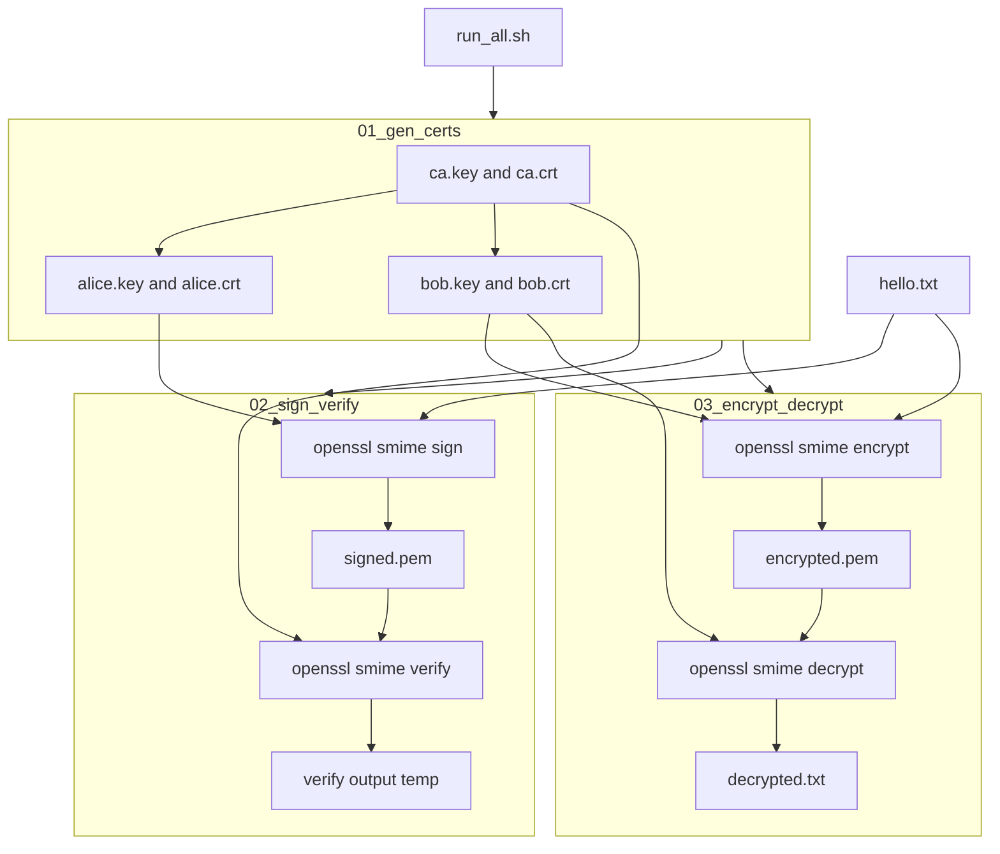
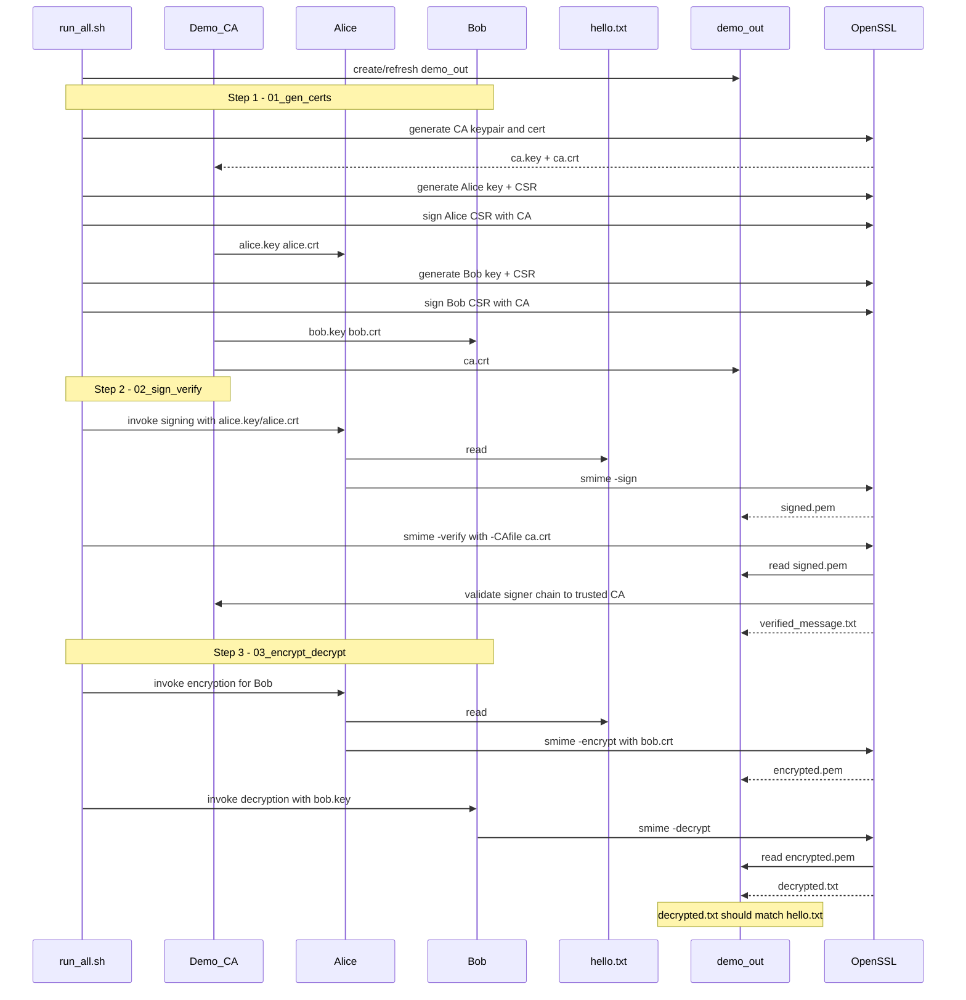

# S/MIME demo (Shell + OpenSSL)

Standalone **normal-flow** lab: sign, verify, encrypt, and decrypt using PEM certificates and OpenSSL’s `smime` command. **CVE-related demos** live in sibling folders at the repository root (`poc_cve_*`, `CVE-*`), not here.

- **Sign** — Alice’s private key produces a CMS/PKCS#7 signature over the message; verifiers use Alice’s certificate and trust in the issuing CA.
- **Encrypt** — The message is encrypted for **Bob’s public key** (from Bob’s certificate); only Bob’s private key can decrypt.

This is for **learning only**. Keys and the demo CA are generated locally and are **not** safe for production.

## Prerequisites

- `bash`
- `openssl` on your `PATH`

## Run

From the repository root:

```bash
./smime-demo/scripts/run_all.sh
```

Or from this directory:

```bash
./scripts/run_all.sh
```

That creates `demo_out/`, generates a demo CA plus Alice and Bob certificates, signs and verifies [messages/hello.txt](messages/hello.txt), then encrypts and decrypts the same file. After a successful run:

- [demo_out/decrypted.txt](demo_out/decrypted.txt) matches the plaintext in `messages/hello.txt` (line endings normalized).
- [demo_out/signed.pem](demo_out/signed.pem) holds the S/MIME signature; verification runs during step 2 (output path is printed to the terminal).

OpenSSL often writes **CRLF** line endings and, with `-text` signing, a short **MIME header** before the body. The decrypt script normalizes line endings to Unix **LF** in `decrypted.txt`.

## Diagrams

### Full demo flow (flowchart)



### Alice, Bob, and CA (full sequence diagram)


